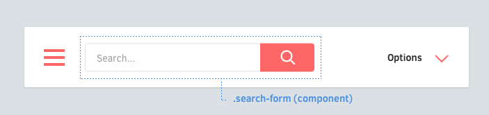

# コンポーネント について

コンポーネントについて考えるために、まずUIにそれぞれの要素を「コンポーネント」として考えてみてください.

## コンポーネントの命名規則

コンポーネントは**少なくとも2語**必要です。それぞれの単語はダッシュ（ `-` ）で区切られます。

例えば:

* いいねボタン（`.like-button`）
* 検索フォーム（`.search-form`）
* ニュース記事カード\(`.article-card`\)
* ネームスペース付きコンポーネント（`.rico-custom-header`）

どうやったら正しくコンポーネントを書けるでしょうか？次のElementsで学んでみましょう. [Continue →](https://app.gitbook.com/@shufo/s/rscss/~/drafts/-LzJ1Y5OzltmnbwgEVZx/konpnentocomponents/elements)

